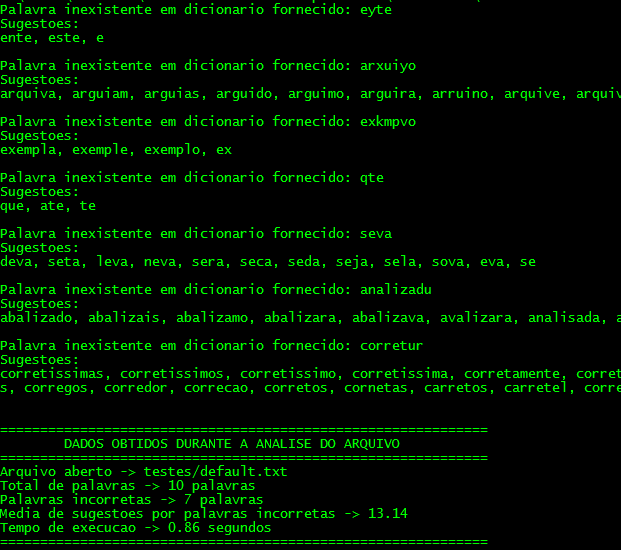

<h1 align="center">:closed_book: <b>Corretor Ortográfico</b> </h1>
<p align="center">
   Com objetivo de corrigir palavras escritas de maneira incorreta em um arquivo de texto, utilizamos uma árvore de prefixos a fim de armazenar um dicionario, onde desfrutamos do mesmo para verificar a ortografia de cada palavra presente no arquivo em questão.
 </p>
<p align="center">


</p>
<br>


## :red_circle: Como Utilizar

```bash
# Clone este repositório
$ git clone https://github.com/jhonatancunha/corretor_ortografico

# Acesse a pasta do projeto no terminal/cmd
$ cd corretor_ortografico

# Execute o makefile (windows)
$ mingw32-make

# Execute o makefile (linux)
$ make

# Por fim inicie o executavel
#Windows
$ main "nome_arquivo.txt" 

#Linux
$ ./main "nome_arquivo.txt"
```

## :mag: Explicação dos Argumentos

| Argumento          | Descrição                                                                               |
| ------------------ | --------------------------------------------------------------------------------------- |
| "nome_arquivo.txt" | É o arquivo .txt que você deseja verificar se a ortografia das palavras estão corretas. |

## :camera_flash: Exemplo
```bash
#Executei passando os seguintes argumentos
#Windows
$ main "testes/default.txt"

#Linux
$ ./main "testes/default.txt"
```


Obtemos as seguintes informações como saida do algoritmo.<br />

<p align="center">
  
</p>
<br />

### :bulb: Comparação do texto incorreto do arquivo e sua versão correta

| STATUS    | TEXTO                                                      |
| --------- | ---------------------------------------------------------- |
| Incorreto | Eyte e um arxuiyo exkmpvo qte seva analizadu pelu corretur |
| Correto   | Este e um arquivo exemplo que sera analisado pelo corretor |

## :vertical_traffic_light: Regras Utilizadas

  ### Regra 1

  <br />
  Nesta palavra utilizaremos a técnica de alternar coringas com objetivo de encontrar qual a letra incorreta em nossa palavra. Coringas serão representados pelo caracter <i>'*'</i>, e na posição referente a ele, podemos usar qualquer letra do alfabeto até encontrar a correta.
  <br /><br />

  :mag_right: Palavra: *hoye*

  | Prefixo Procurado | Resultado |
  | ----------------- | --------- |
  | *oye              | NULL      |
  | h*ye              | NULL      |
  | ho*e              | hoje      |
  | hoy*              | NULL      |
  <br />  

  ### Regra 2

  <br />
  Utilizaremos esta regra em palavras com mais de 5 letras, onde iremos pesquisar uma palavra <b><i>p</i></b> que vá até a posição n-3 e n-2. Tal regra nos retorna chaves que casam com o prefixo procurado.
  <br /><br />

  :mag_right: Palavra: *saladq*

  | Prefixo Procurado | Resultado       |
  | ----------------- | --------------- |
  | salad             | salada, saladas |
  | sala              | sala, salada    |
  <br /> 

  ### Regra 3

  <br />
  Esta regra retorna o maior prefixo válido de uma palavra procurada. A fim de exemplo, ao pesquisar a palavra "zebraolho", receberemos a chave "zebra" como retorno.
  <br /><br />

  :mag_right: Palavra: *zebraolho*

  | Prefixo Procurado | Resultado |
  | ----------------- | --------- |
  | zebraolho         | zebra     |
  <br />  

  
  ### Regra 4

  <br />
  Essa regra é formulada via conjunção da regra 1 com a regra 2, ou seja, aplicaremos a regra 2 na palavra alvo e logo após a regra 1. 
  <br /><br />

  :mag_right: Palavra: *xinamiyb*

  | Prefixo Procurado | Resultado                                                                      |
  | ----------------- | ------------------------------------------------------------------------------ |
  | <b>dinamiy</b>    | <b>CASO N-2</b>                                                                |
  | *inamiy           | NULL                                                                           |
  | x*namiy           | NULL                                                                           |
  | xi*amiy           | NULL                                                                           |
  | xin*miy           | NULL                                                                           |
  | xina*iy           | NULL                                                                           |
  | xinami*           | NULL                                                                           |
  | <b>dinami</b>     | <b>CASO N-3</b>                                                                |
  | *inami            | dinamica, dinamico, dinamita, dinamite, dinamito, dinamiza, dinamize, dinamizo |
  | x*nami            | NULL                                                                           |
  | xi*ami            | NULL                                                                           |
  | xin*mi            | NULL                                                                           |
  | xina*i            | NULL                                                                           |
  | xinam*            | NULL                                                                           |
  <br />  

   ### Regra 5

  <br />
  Essa regra é baseada na regra 1, porém, agora iremos utilizar dois coringas. Onde um ficará fixado em uma posição, enquanto o outro irá percorrer a palavra.
  <br /><br />

  :mag_right: Palavra: *xinxmite*

  | Prefixo Procurado | Resultado |
  | ----------------- | --------- |
  | **nxmite          | NULL      |
  | \*i\*xmite        | NULL      |
  | \*in\*mite        | dinamite  |
  | \*inx\*ite        | NULL      |
  | etc...            | NULL      |

  <br /> 

  ### Regra 6

  <br />
  Essa regra foi pensada para encontrar palavras que contém letras repetidas ou inexistentes, a mesma intercala pelos caracteres da palavras anulando-os. A fim de exemplificar, ao procurarmos a palavra "caasa", o código tenta encontrar as chaves: aasa, casa, casa, caaa, caas.
  <br /><br />

  :mag_right: Palavra: *commentario*

  | Prefixo Procurado | Resultado  |
  | ----------------- | ---------- |
  | ommentario        | NULL       |
  | cmmentario        | NULL       |
  | comentario        | comentario |
  | comentario        | comentario |
  | commntario        | NULL       |
  | commetario        | NULL       |
  | commenario        | NULL       |
  | commentrio        | NULL       |
  | commentaio        | NULL       |
  | commentaro        | NULL       |
  | commentari        | NULL       |
  <br /> 


## :mortar_board: Autores

<table><tr>
<td align="center"><a href="https://github.com/jhonatancunha">
 
<br />
 <b>Jhonatan Cunha</b></a>
 <a href="https://github.com/jhonatancunha" title="Repositorio Jhonatan"></a>

[](mailto:jhonatancunha@alunos.utfpr.edu.br)</td>

<td align="center"><a href="https://github.com/JessePires">
 
<br />
 <b>Jessé Pires</b>
 </a> <a href="https://github.com/JessePires" title="Repositorio Jessé"></a>

[](mailto:jessepires@alunos.utfpr.edu.br)</td>
</tr></table>

## :memo: Licença
[MIT](https://choosealicense.com/licenses/mit/)
